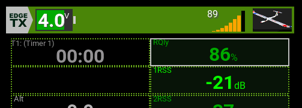

# EdgeTX Widgets – LinkMeter & BattMeter

Two widgets for EdgeTX (2.10.2 or similar).

---

## LinkMeter

A graphical representation of your radio link quality.  
It primarily uses the `RQly` (Radio Quality) sensor value.  
If `RQly` is not available, it automatically falls back to the best RSSI value from `1RSS`, `2RSS`, or `RSSI`.

**Display**: 12 horizontal bars, growing in height from left to right.  
The bar color changes based on quality level:

- **Low** (< 80%) – Low color (default: red)  
- **Medium** (80–89%) – Medium color (default: orange)  
- **High** (≥ 90%) – High color (default: green)

**Options**:

| Name        | Type   | Description                                      | Default          |
|-------------|--------|--------------------------------------------------|------------------|
| ShowPercent | BOOL   | Show numeric percentage above bars               | 1                |
| Text        | COLOR  | Text color                                        | White            |
| Shadow      | COLOR  | Text shadow color                                 | Dark gray        |
| Low         | COLOR  | Bar color for low quality                         | Red              |
| Medium      | COLOR  | Bar color for medium quality                      | Orange           |
| High        | COLOR  | Bar color for high quality                        | Green            |

---

## BattMeter

A graphical representation of your transmitter or receiver battery status.  
Takes either:

- `tx-voltage` (Radio Battery) – default  
- `RxBt` (Receiver Battery)

**Options**:

| Name     | Type   | Description                           | Default |
|----------|--------|---------------------------------------|---------|
| Source   | SOURCE | Voltage source                        | tx-voltage |
| PerCell  | BOOL   | Show per-cell voltage                  | 0       |
| Low      | COLOR  | Low voltage color                      | Red     |
| Medium   | COLOR  | Medium voltage color                   | Orange  |
| High     | COLOR  | High voltage color                     | Green   |

---

