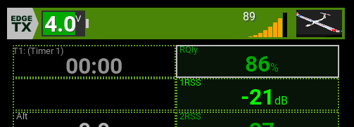

# EdgeTX Widgets: LinkMeter & BattMeter
Widgets for EdgeTX (2.10.2 or similar).

## Screenshot

---

## Important: First-Time Setup

After adding a widget, the default values are not functional — you **must open the widget options once** and configure at minimum the sensor and battery type. EdgeTX does not apply defaults until the options have been saved manually.

---

## LinkMeter

A graphical representation of the quality of your connection.  
It combines **`RQly`** and **`RSSI`** into a single visual indicator.

**Features**:
- Horizontal bars (left to right, increasing height)
- Number of bars is fully configurable
- Color thresholds for low, medium, and high signal quality are configurable
- Automatically selects and combines the best available signal sources:
  1. **`RQly`**
  2. Best of **`1RSS`** and **`2RSS`**
  3. **`RSSI`**

**Options**:
| Name        | Type  | Description                                | Default |
|-------------|-------|--------------------------------------------|---------|
| ShowPercent | BOOL  | Show combined RQly + RSSI score as percent | 1       |
| Text        | COLOR | Font color                                 | White   |
| Shadow      | COLOR | Font shadow color                          | Gray    |
| BarCount    | VALUE | Number of bars (4–22)                      | 10      |
| BarColor    | COLOR | Bar color when signal is empty             | Gray    |
| Low         | COLOR | Bar color for low signal (< 80%)           | Red     |
| Medium      | COLOR | Bar color for medium signal (80–89%)       | Orange  |
| High        | COLOR | Bar color for high signal (≥ 90%)          | Green   |

---

## BattMeter

A graphical representation of your transmitter or receiver battery status.

**Features**:
- Supports TX battery (`tx-voltage`) and RX battery (`RxBt`)
- Supports Li-Po, Li-Ion, and LiFe chemistry
- Configurable cell count
- Voltage smoothing (moving average over 5 samples)
- Color thresholds: Full, High, Medium, Low, Critical

**Options**:
| Name           | Type   | Description                                               | Default  |
|----------------|--------|-----------------------------------------------------------|----------|
| Battery-Sensor | CHOICE | Sensor: `tx-voltage` or `RxBt`                           | tx-voltage |
| Battery-Type   | CHOICE | Cell chemistry: Li-Po, Li-Ion, or LiFe                   | Li-Po    |
| Cells          | VALUE  | Number of cells (1–8)                                     | 2        |
| PerCell        | BOOL   | Sensor delivers total voltage (1) or per-cell voltage (0) | 1        |
| Text           | COLOR  | Voltage text color                                        | White    |
| Shadow         | COLOR  | Voltage text shadow color                                 | Dark gray |
| BatColor       | COLOR  | Empty battery body color                                  | Dark gray |
| Full           | COLOR  | Fill color for 80–100%                                    | Green    |
| High           | COLOR  | Fill color for 60–79%                                     | Olive    |
| Medium         | COLOR  | Fill color for 40–59%                                     | Yellow   |
| Low            | COLOR  | Fill color for 20–39%                                     | Orange   |
| Critical       | COLOR  | Fill color for 0–19%                                      | Red      |
