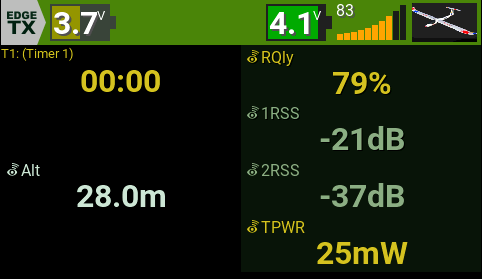

# EdgeTX Widgets: LinkMeter & BattMeter

Two custom widgets for EdgeTX (2.10.2 or similar).

---

## LinkMeter

A graphical representation of the quality of your connection.  
It combines **RQly** and RSSI into a single visual indicator.

**Features**:
- 9 horizontal bars (left to right, increasing height)
- First 3 bars = low quality, next 3 = medium, last 3 = high
- Colors for empty, low, medium, and high are configurable
- Automatically selects the best available signal source:
  1. `RQly`
  2. Average of `RSSI1` and `RSSI2`
  3. `RSSI`

**Options**:

| Name   | Type  | Description                               | Default   |
|--------|-------|-------------------------------------------|-----------|
| Empty  | COLOR | Bar color when signal is empty            | Gray      |
| Low    | COLOR | Bar color for low signal                  | Red       |
| Medium | COLOR | Bar color for medium signal               | Orange    |
| High   | COLOR | Bar color for high signal                 | Green     |

---

## BattMeter

A graphical representation of your transmitter or receiver battery status.  
It can display either:

- **TX battery voltage** (`tx-voltage`) – default
- **RX battery voltage** (`RxBt`)

**Options**:

| Name       | Type   | Description                                                | Default   |
|------------|--------|------------------------------------------------------------|-----------|
| tx_voltage | BOOL   | Use TX battery voltage (1) or RX battery voltage (0)       | 1         |
| Cells      | VALUE  | Number of cells (1–8)                                      | 3         |
| PerCell    | BOOL   | Show voltage per cell (1) or total voltage (0)              | 1         |
| Text       | COLOR  | Voltage text color                                         | White     |
| Shadow     | COLOR  | Voltage text shadow color                                  | Dark gray |
| Full       | COLOR  | Bar color for 80–100% battery                              | Green     |
| High       | COLOR  | Bar color for 60–79% battery                               | Olive     |
| Medium     | COLOR  | Bar color for 40–59% battery                               | Yellow    |
| Low        | COLOR  | Bar color for 20–39% battery                               | Orange    |
| Empty      | COLOR  | Bar color for 0–19% battery                                | Red       |

---

## Screenshot

---
